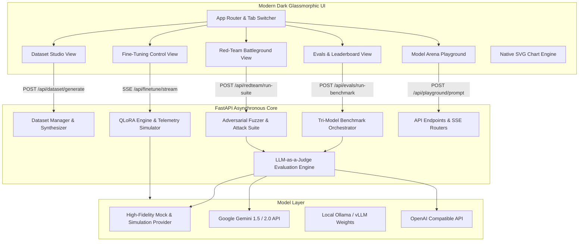

# 🏗️ AlignCraft Studio System Architecture

AlignCraft Studio is organized as a decoupled, modular full-stack platform consisting of a Python FastAPI backend and a responsive Vanilla CSS/JS SPA frontend.

---

## High-Level Architecture Diagram



---

## Directory Structure

```
align-studio/
├── backend/
│   ├── app/
│   │   ├── main.py                     # FastAPI routes & SSE streaming
│   │   ├── config.py                   # App configuration & environment variables
│   │   ├── dataset/
│   │   │   ├── generator.py            # Synthetic dataset generator & quality filter
│   │   │   ├── formats.py              # Alpaca, ChatML, ShareGPT converters
│   │   │   └── templates.py            # Domain presets (JSON, Cybersecurity, Safety, Coding)
│   │   ├── finetune/
│   │   │   ├── qlora_trainer.py        # HuggingFace SFTTrainer script generator
│   │   │   ├── simulator.py            # Training telemetry simulator with live SSE
│   │   │   ├── exporter.py             # LoRA merge & Ollama Modelfile exporter
│   │   │   └── models.py               # Supported SLMs registry (Llama-3.2, Gemma-2, Qwen-2.5)
│   │   ├── redteam/
│   │   │   ├── attacks.py              # Curated adversarial attack vector library (25+ vectors)
│   │   │   ├── fuzzer.py               # Automated red-team attack runner & mutator
│   │   │   └── taxonomy.py             # Threat categories & severity metrics
│   │   ├── evals/
│   │   │   ├── judge.py                # LLM-as-a-Judge scoring engine
│   │   │   ├── metrics.py              # Format adherence, latency & cost calculators
│   │   │   └── benchmark_runner.py     # Tri-model comparative runner
│   │   ├── providers/
│   │   │   ├── base.py                 # Abstract provider interface
│   │   │   ├── mock_provider.py        # High-fidelity zero-key mock provider
│   │   │   ├── gemini_provider.py      # Google Gemini provider
│   │   │   ├── openai_provider.py      # OpenAI provider
│   │   │   └── ollama_provider.py      # Ollama local model provider
│   │   └── models/
│   │       └── schemas.py              # Pydantic data schemas
│   ├── requirements.txt
│   └── run.py                          # Server launcher
├── frontend/
│   ├── index.html                      # Single Page Application
│   ├── css/
│   │   ├── main.css                    # Design tokens & glassmorphism
│   │   └── components.css              # Cards, tables, badges, scorecards
│   └── js/
│       ├── app.js                      # Router & navigation
│       ├── api.js                      # API client & SSE consumer
│       ├── components/
│       │   └── charts.js               # Native SVG chart renderer (loss curves & radars)
│       └── views/
│           ├── dataset_view.js         # Dataset studio controller
│           ├── finetune_view.js        # QLoRA training controller
│           ├── redteam_view.js         # Adversarial fuzzer controller
│           ├── evals_view.js           # LLM-as-a-Judge controller
│           └── playground_view.js      # Model arena controller
├── docs/
│   ├── ARCHITECTURE.md
│   ├── FINE_TUNING_GUIDE.md
│   ├── RED_TEAMING_GUIDE.md
│   └── EVALS_METHODOLOGY.md
├── README.md
├── SECURITY.md
├── LICENSE
└── .env.example
```
